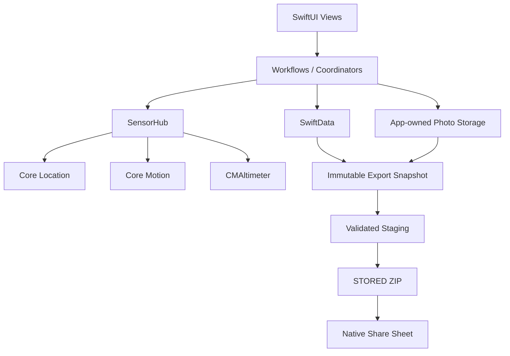

# RoomMarker — Campus Indoor-Navigation Data Collection

RoomMarker is a cross-platform field application for collecting structured indoor-navigation evidence: Rooms, reference points, Markers, sensor Tracks, tags, and photographs.

## Why RoomMarker exists

Indoor-navigation work needs more than a floor-plan image. A field team must associate physical places with repeatable observations, record how sensor readings change along a route, and preserve contextual evidence for later analysis.

RoomMarker organises that work around Areas and Rooms. It captures best-effort device readings without inventing missing values, keeps Track media under application ownership, and exports a portable JSON/JPEG archive. The original implementation targets HarmonyOS; the iOS version preserves the data meaning while adapting the workflow to Apple's APIs, permissions, and lifecycle rules.

## Current status

The native iOS student-project MVP is complete through physical-device acceptance.

- Native Swift 6, SwiftUI, and SwiftData implementation
- Deployment target: iOS 17 or later
- Final validation toolchain: Xcode 27.0 with the iOS 27 SDK
- Automated baseline: **203 tests in 11 suites; 0 failed; 0 skipped**
- Simulator regression: iPhone 18 Pro / iOS 27.0
- Physical acceptance: iPhone 15 Pro / iOS 26.7
- No third-party runtime dependencies

This is an accepted course-project baseline, not a claim of universal production hardening or continuous-integration coverage.

## Core capabilities

- Create and organise Areas, Rooms, and typed Room Markers.
- Capture a Room reference snapshot and a sensor-backed Marker snapshot.
- Inspect live location, pressure, magnetometer, and heading states.
- Take a bounded one-time sensor snapshot with per-source outcomes.
- Record an Area-bound Track in the foreground and during supported Home-background or lock-screen intervals.
- Add typed tags and user notes while recording.
- Capture a real camera photo, store an application-owned JPEG, and associate sensor metadata with it.
- Inspect completed or interrupted Tracks, samples, tags, photos, and full-size previews.
- Export immutable v2 snapshots as JSON and JPEG files inside a validated STORED ZIP.
- Share exactly one final ZIP through the native Share Sheet.
- Delete individual photos or cascade-delete a Track and its owned data.
- Detect a Track left incomplete by process termination without fabricating an end time or automatically resuming it.

## HarmonyOS and iOS feature map

The implementations share product concepts and export semantics, but each uses its platform's native facilities.

| Capability | HarmonyOS | iOS |
| --- | --- | --- |
| Area management | Create and organise; deletion can preserve or cascade-delete contents | Create/edit; deletion preserves Rooms and Tracks under `未分区` |
| Room management | Create, inspect, and delete with Marker cleanup | Create, edit, move, inspect, and delete with Marker cascade |
| Room reference capture | Location, altitude, and pressure snapshot | Bounded snapshot with explicit replacement semantics |
| Marker management | Create and delete | Create, edit, and delete |
| Marker sensor capture | Location, accuracy, altitude, pressure, magnetic axes | Equivalent optional fields; metadata edits preserve the capture |
| Live sensors | Native live sensors plus nearby Wi-Fi results | Location, pressure, magnetic axes, and heading |
| Snapshot capture | Used by Room and Marker workflows | Dedicated snapshot screen plus Room and Marker workflows |
| Foreground recording | Nominal one-second Track sampling | Nominal one-second Track sampling, physically validated |
| Home-background recording | HarmonyOS location long-running task | Foreground-started Core Location background activity |
| Lock-screen recording | Supported by the HarmonyOS background workflow | Physically validated as one continuous active session |
| GPS/location | Supported | Core Location; optional when denied or unavailable |
| Pressure | Supported | `CMAltimeter`, where supported |
| Magnetometer | Supported | Core Motion magnetometer |
| Heading | Sensor fusion with location fallback | Core Location device heading when available |
| Tags | Six typed Track tags with notes | Same six stable tag values with notes |
| Camera/photos | System camera picker and app-owned copy | User-initiated camera capture and app-owned JPEG |
| Track detail | Statistics, points, tags, photos, and path view | Overview, sensor-rich points, tags, photos, and preview |
| ZIP export | v1 JSON, photos, and manifest | v2 JSON, photos, capabilities, and manifest |
| Native sharing | System document-save workflow | Native Share Sheet with one final ZIP |
| Cleanup | Area/Track cascades and photo-file cleanup | Individual photo and Track cascade cleanup |
| Incomplete Track | Missing end time can remain displayed as active | Explicit `需要处理` state; manual finalise or delete |
| Wi-Fi fingerprinting | Nearby AP count and Top-5 BSSID/RSSI | Intentionally unsupported; no fabricated observations |

Normal iOS applications do not have a supported general-purpose equivalent to HarmonyOS nearby BSSID/RSSI scanning. The iOS v2 capability declaration therefore states:

```text
nearbyWifiFingerprint: unsupported
```

This is an intentional platform difference, not an implementation failure.

## Architecture

The application separates UI, workflow state, persistence, hardware services, media ownership, and export serialization. SwiftData models are not encoded directly into export files.



Technical details are in [IOS_ARCHITECTURE.md](IOS_ARCHITECTURE.md).

## Quick Start

### Requirements

- macOS with Xcode 27.0 for the final validated configuration
- An iOS 17-or-later simulator, or a compatible physical iPhone
- An Apple development team selected locally when installing on a physical device

The project intentionally leaves `DEVELOPMENT_TEAM` unset. Do not commit personal signing settings, profiles, or identifiers.

### Build and run

1. Clone the repository and check out `iOS-Application`.
2. Open `RoomMarker.xcodeproj` in Xcode.
3. Select the shared `RoomMarker` scheme.
4. Choose an installed iOS Simulator and run the application.
5. For a physical iPhone, select a development team locally and use a bundle identifier available to that team if Xcode requires it.
6. Accept permissions only when the corresponding feature is used.

The simulator is suitable for navigation and deterministic tests, but absent or synthetic simulator readings are not evidence of physical sensor behavior. Use a physical device for camera, pressure, magnetometer, heading, and background/lock-screen validation.

### Run tests

In Xcode, select the `RoomMarker` scheme and choose **Product → Test**. The accepted baseline used the iPhone 18 Pro / iOS 27.0 Simulator and completed 203 tests across 11 suites.

## Suggested 3–5 minute demo

Use non-sensitive, prepared demo data so the workflow—not setup time—is the focus.

1. Open an existing Area and Room.
2. Capture or replace the Room reference snapshot.
3. Create or show a sensor-backed Marker.
4. Open `实时传感器` and move or rotate the physical device.
5. Start a short Area-bound Track.
6. Add one Tag.
7. Capture one Photo and add a note.
8. Stop recording.
9. Inspect Track Detail, samples, the Tag, and the Photo preview.
10. Export the Area.
11. Show the native Share Sheet and final ZIP.
12. Briefly explain the iOS Wi-Fi platform difference.

Keep permission-denial, destructive cleanup, force-quit recovery, and minute-long lock-screen scenarios as recorded evidence rather than normal live-demo steps.

## Permissions and lifecycle behavior

| Concern | Implemented behavior |
| --- | --- |
| Location | Requests When In Use authorization; the app does not request Always authorization |
| Background recording | Must be explicitly started by the user in the foreground; Core Location background activity is owned only while recording |
| Scheduling | iOS controls execution opportunities; exact one-second background sampling is not promised |
| Core Motion | Protected by `NSMotionUsageDescription` |
| Camera | Requested only after the user initiates Track photo capture |
| Photos Library | No Photos Library permission and no automatic save to Photos |
| Denied/unavailable sensors | Values remain absent; the app does not substitute synthetic zeros |
| Force quit | Recording stops; the persisted Track remains incomplete without a fabricated end time or automatic resume |

Location denial degrades location fields without preventing independent supported sensors from reporting. Permission recovery is user-driven and does not repeatedly prompt.

## Platform differences and known limitations

- Nearby Wi-Fi fingerprint scanning is available in the HarmonyOS implementation but unsupported in the normal iOS application.
- Background delivery and timing remain controlled by iOS; the app records actual timestamps and creates no catch-up points.
- Force-quit survival and automatic recording restart are intentionally unsupported.
- Only one physical device/OS combination completed the final acceptance procedure.
- Multi-hour, poor-signal, low-power, thermal-pressure, reboot, and storage-exhaustion scenarios remain outside the accepted baseline.
- The custom archive writer produces STORED ZIP32 archives. Very large field collections require separate scale validation.
- Export snapshot creation currently retains validated photo bytes in memory before staging.

## Testing and physical-device evidence

The accepted Phase 9 baseline covers:

- Room reference replacement and persistence after relaunch
- Marker capture and sensor preservation during metadata editing
- Live Sensors and bounded snapshot capture
- Foreground, Home-background, and lock-screen Track recording
- Tag and real camera/photo association
- Track Detail, thumbnail, metadata, and full-size preview
- ZIP creation, Share Sheet presentation, saved-archive inspection, and source immutability
- Individual photo deletion and Track cascade cleanup
- Graceful location-denied behavior without fake coordinates or prompt loops
- Force-quit detection of an incomplete Track without automatic resume
- Export defenses against traversal, absolute paths, sibling-prefix attacks, symlink escape, and filesystem aliases

See [IOS_PHASE9_DEVICE_ACCEPTANCE.md](IOS_PHASE9_DEVICE_ACCEPTANCE.md) for the bounded physical evidence and remaining risks. This evidence does not claim universal production reliability or hosted CI coverage.

## Export format

An iOS v2 Area export contains:

- `manifest.json`
- one JSON file per Track under `tracks/`
- app-owned JPEG files under relative `photos/` paths when present
- `sourcePlatform: ios`
- a capabilities declaration including `nearbyWifiFingerprint: unsupported`

Manifest references and photo paths are relative. Staging, archive sources, and cleanup remain within RoomMarker-owned canonical directories. Export works from an immutable snapshot, does not mutate SwiftData source models, and does not move or delete source photos. The native Share Sheet receives one completed ZIP, not its staging directory.

## Documentation

- [iOS project brief](IOS_PROJECT_BRIEF.md) — historical Phase 0 product and compatibility brief
- [iOS architecture](IOS_ARCHITECTURE.md) — as-built technical architecture
- [iOS implementation plan](IOS_IMPLEMENTATION_PLAN.md) — historical phased plan
- [HarmonyOS parity closure](IOS_PHASE9_5_PARITY_NOTES.md) — Room/Marker sensor parity record
- [Physical-device acceptance](IOS_PHASE9_DEVICE_ACCEPTANCE.md) — final Phase 9 evidence and limits

Visual evidence is planned for a later Phase 10 step; this README intentionally contains no broken screenshot references.
